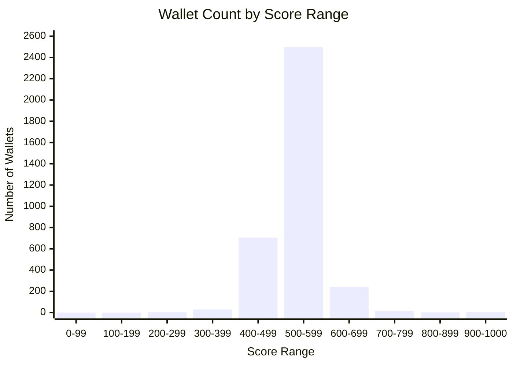

# DeFi Wallet Credit Score Analysis

## Score Distribution Overview 



```mermaid
xychart-beta
    title "Cumulative % of Wallets by Score (3500 Wallets Total)"
    x-axis "Credit Score" [0, 100, 200, 300, 400, 500, 600, 700, 800, 900, 1000]
    y-axis "% of Wallets" 0-->100
    line [0, 0, 0.09, 0.94, 21.1, 92.5, 99.4, 99.9, 100, 100, 100]